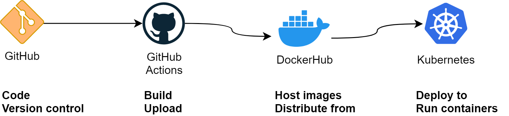

How can you use Github Actions to build your code into containers and ship them to Kubernetes?



Here's one of my favorite pipelines, using Github Actions for tagging and building and DockerHub for hosting container images.



```yaml
name: Auto deployment
on:
  push:
    branches:
      - master
jobs:
  deploy:
    runs-on: ubuntu-latest
    strategy:
      matrix:
        node-version: [12.x]
    steps:
      - name: Checkout Git repo
        uses: actions/checkout@master

      # Version bump
      - name: Automated Version Bump
        id: versionBump
        uses: TriPSs/conventional-changelog-action@v3
        with:
          github-token: ${{ secrets.GITHUB_TOKEN }}
          tag-prefix: ""
          skip-on-empty: "false"
          skip-version-file: true
      - name: Automated GitHub Release
        uses: actions/create-release@v1
        if: ${{ steps.versionBump.outputs.skipped == 'false' }}
        env:
          GITHUB_TOKEN: ${{ secrets.GITHUB_TOKEN }}
        with:
          tag_name: ${{ steps.versionBump.outputs.tag }}
          release_name: ${{ steps.versionBump.outputs.tag }}
          body: ${{ steps.versionBump.outputs.clean_changelog }}

      # Docker build
      - name: Set up Docker Buildx
        id: buildx
        uses: docker/setup-buildx-action@master
      - name: Cache Docker layers
        uses: actions/cache@v2
        with:
          path: /tmp/.buildx-cache
          key: ${{ runner.os }}-buildx-${{ github.sha }}
          restore-keys: |
            ${{ runner.os }}-buildx-
      - name: Login to Docker Hub
        uses: docker/login-action@v1
        with:
          username: ${{ secrets.DOCKER_HUB_USERNAME }}
          password: ${{ secrets.DOCKER_HUB_PASSWORD }}
      - name: Build and push
        id: docker_build
        uses: docker/build-push-action@v2
        with:
          context: ./
          file: ./Dockerfile
          builder: ${{ steps.buildx.outputs.name }}
          push: true
          tags: <dockerhub-user>/<repo>:release-${{ steps.versionBump.outputs.tag }}
          cache-from: type=local,src=/tmp/.buildx-cache
          cache-to: type=local,dest=/tmp/.buildx-cache

      # Deploy to kubernetes repo
      - name: Install SSH Key
        uses: shimataro/ssh-key-action@v2
        with:
          key: ${{ secrets.KUBERNETES_SSH_KEY_PRIV }}
          known_hosts: |
            github.com ssh-rsa (...public ssh key...)
      - name: update repo
        run: |
          # VARIABLES
          TAG="${{ steps.versionBump.outputs.tag }}"
          URL="git@github.com:GithubOrganization/kubernetes.git"

          # SETUP
          git config --global user.email "robot@example.com"
          git config --global user.name "Robot"
          git clone $URL
          cd kubernetes

          # CHANGES
          sed -i "s/release-.*$/release-$TAG/" ./<path>/deployment.yaml

          # PUSH
          git remote set-url origin $URL
          git add .
          git commit -m "Release version $TAG"
          git push
```


