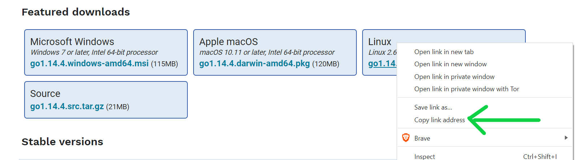

First off, go to the official download pages - [https://golang.org/dl/](https://golang.org/dl/). Right-click and copy the link address from the option that matches your operating system (mac, linux).



Open up a terminal in the `/tmp` directory, then download the link that you just copied:

```bash
cd /tmp
wget https://golang.org/dl/go1.14.4.linux-amd64.tar.gz
```

Next up, un-archive the binaries and move them to the `/usr/local` directory

```bash
sudo tar -xvf go1.14.4.linux-amd64.tar.gz
sudo mv go /usr/local
```

Lastly, open up your `.profile` file (or `.bash_profile`) with your favourite text editor, and copy in the following:

```bash
export PATH=$PATH:/usr/local/go/bin
```

## The end!

Check that your install worked by opening up a new terminal and trying a basic go command, such as:

```bash
go version
```
