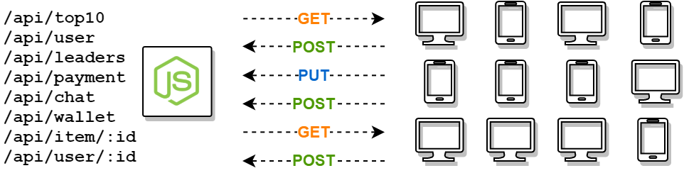

Javascript is a great scripting language. It's easy to learn the basics, it's vastly popular, has a huge ecosystem of frameworks, plugins, packages... And it runs everywhere, including server-side.

In this post I'll show you how easy it is to get started from zero to a REST API.

Let's go do it!

## Step 1: Install Node.js

Takes a minute to do. You go to [nodejs.org](https://nodejs.org/), download and install it. Done!

## Step 2: Initiate project

In a terminal, navigate to a location of your choice.

```bash
cd C:/workspace       # for Windows
cd ~/workspace        # for Mac & Linux
```

And execute this command with `npm` (the nodejs package manager):

```bash
npm init
```

_Enter the project information as you wish_

## Step 3: Create a js file

Your entire web-app could technically run from as little as one javascript file. So start simple, start from 1 file: `index.js`

```js
const express = require("express");
const app = express();
const port = 3000;

app.get("/", (req, res) => res.send("Hello World!"));

app.listen(port, () =>
  console.log(`Server listening at http://localhost:${port}`)
);
```

You'll notice on the first line, the name `express`, as an external dependancy. This is a good time to install it. In the terminal:

```bash
npm install express
```

## Step 4: Run it

Again, in the terminal, run:

```bash
node index.js
```

Now open a browser and navigate to [http://localhost:3000](http://localhost:3000)

That's it, you're basically done. You can expand this API by adding new endpoints such as:

```js
app.get("/user", (req, res) => {
  res.send({ message: "json body" });
});
```

From here you get the point... Expand the service, grow it, add your business logic, etc. There's more to say about it, but this should get you started with Node.js for now.
