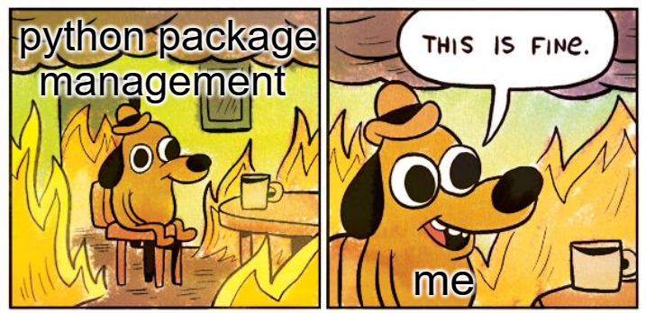

##### TLDR: Python package management is a mess. Poetry can fix that.

If you've ever worked with python before, you may have struggled to wrap your head around all the different ways that you can manage python external dependancies.

It's one of the most annoying things about the python development experience. Out of the box, when you install python, you get `pip`, which you can use to install packages... globally. But what if you run multiple python projects on your machine? What if your different projects have incompatible package versions?

The python answer to this issue - virtual environments. At this point, you'll find yourself utterly confused - what the fuck are virtual environments? what is it venv? what is it virtualenv?

Then you get to the topic of package managers - should it be conda? should it be pipenv?

## Forget it all. Poetry is the way

**Definition:** "Poetry is a tool for dependency management and packaging in Python. It allows you to declare the libraries your project depends on and it will manage (install/update) them for you."

In short, poetry helps you with:

- A simple package management cli
- A simple virtual environment management
- Isolated packages
- Repeatable installs and builds
- All in one experience

Seriously, poetry is the only tool you'll need to manage your python codebases.

## 1. Install

First off, poetry needs to be installed. No biggie, it's a one-off job.

See the installation instructions [here](https://python-poetry.org/docs/#installation)

For linux or mac, installation can be done via:

```bash
curl -sSL https://raw.githubusercontent.com/python-poetry/poetry/master/get-poetry.py | python -

```

## 2. Start a new project

Create a new python project, via the poetry cli:

```bash
# create new project
poetry new demo

# or initiate poetry for an existing codebase
poetry init
```

## 3. Install a dependancy

So far so good. Now let's install a dependancy - any dependancy. I chose numpy for this example:

```bash
poetry add numpy
```

If you have a look at the project file structure, you'll notice a new file called `pyproject.toml`:

```toml
[tool.poetry]
name = "demo"
version = "0.1.0"
description = ""
authors = ["Mihai Nueleanu <mihai.nueleanu@gmail.com>"]

[tool.poetry.dependencies]
python = "^3.8"
numpy = "^1.20.1"

[tool.poetry.dev-dependencies]

[build-system]
requires = ["poetry-core>=1.0.0"]
build-backend = "poetry.core.masonry.api"
```

This file will be the place where poetry will store a record of what packages it's supposed to install, along side with a bit of metadata about the project itself.

_Note: You'll also notice another file called `poetry.lock`, written in a format that's more jibber-jabber than pyproject.toml. Don't worry about it.. it's not meant to be touched, it's only there to help poetry install the right things._

## 4. A quick test drive

Now, bring up you favorite text editor, create a python file, and try to see if the new package is usable. Here's a quick example, in a file called `hello.py`:

```python
from numpy import random

print(random.randn(5, 5))
```

You can then run the script from any terminal:

```bash
> poetry run python hello.py
[[ 0.50567771 -1.13465036  1.11417991  0.0550343   0.76588176]
 [-0.2489556   1.43252123  1.70904471  1.28042324  1.512682  ]
 [-0.6974979   0.19129948 -1.01325838  0.83965527 -0.35822316]
 [ 1.97695199 -0.2095286  -0.60275442  0.57499226 -0.99219837]
 [ 0.3240001  -1.01672498  0.4284231  -1.13982977 -1.30249861]]
```

## 5. In conclusion

Poetry is easy to get started with. And if you incorporate it in your development workflow, it will save you hefty amounts of headache, as well make things more transparent in your project.

Your projects will be repeatable, and consistent across environments, whether you're running inside a docker container, classic virtual machine, or any other hosting platform.

Another thing is - I just scratched the surface of all the goodies that come with poetry. Here's a quick glance, of some other stuff poetry can do:

```bash
> poetry --help

AVAILABLE COMMANDS
  about         Shows information about Poetry.
  add           Adds a new dependency to pyproject.toml.
  build         Builds a package, as a tarball and a wheel by default.
  cache         Interact with Poetry's cache
  check         Checks the validity of the pyproject.toml file.
  config        Manages configuration settings.
  debug         Debug various elements of Poetry.
  env           Interact with Poetry's project environments.
  export        Exports the lock file to alternative formats.
  help          Display the manual of a command
  init          Creates a basic pyproject.toml file in the current directory.
  install       Installs the project dependencies.
  lock          Locks the project dependencies.
  new           Creates a new Python project at <path>.
  publish       Publishes a package to a remote repository.
  remove        Removes a package from the project dependencies.
  run           Runs a command in the appropriate environment.
  search        Searches for packages on remote repositories.
  self          Interact with Poetry directly.
  shell         Spawns a shell within the virtual environment.
  show          Shows information about packages.
  update        Update the dependencies as according to the pyproject.toml file.
  version       Shows the version of the project or bumps it when a valid bump rule is provided.
```

That's all for now. Get coding!
