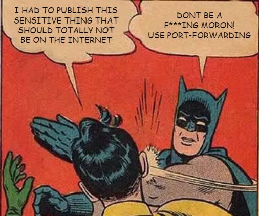

You might have found yourself in this situation before. You have a remote server, on which you've installed some software/services which you can manage via a web application.

Could be a server management tool, or remote pi hole installation, or syncthing...

No matter how secure it claims to be, this app does **NOT** need to be online (on the internet) for you to use it. How about if you could just access this remote service **only** from you local machine? And all without having to have to manage some apache server, whitelisting IPs, or using Basic Authentication to shield the webserver?

Well, there's a way to do all of this via SSH port forwarding (tunnelling). Which could be very convenient, since you're likely already using ssh to administer the machine in some way or another. It's very simple, here's how you do it:

```bash
# the example:
ssh -L 8080:localhost:8080 mn@example.com

# the recipe:
# [1] - local port
# [2] - host you want to connect to once you're on the remote
# [3] - remote port
# [4] - remote address (ssh address)
ssh -L [1]:[2]:[3] [4]
```

Essentially what's happening, is that you're connecting to a remote host via ssh, and tunnelling local traffic to/from an arbitrary host on a specified port.

That's all. Enjoy!
